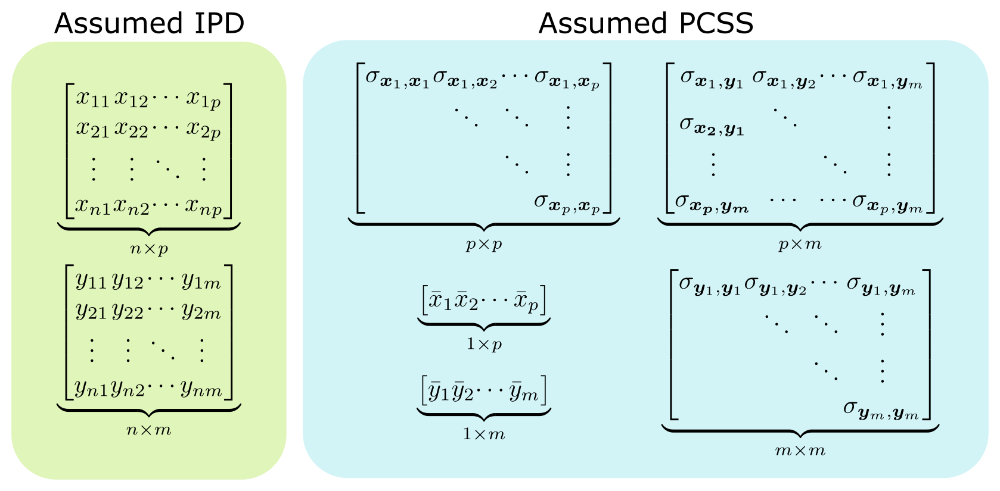

<!-- README.md is generated from README.Rmd. Please edit that file -->

```{r, include = FALSE}
knitr::opts_chunk$set(
  collapse = TRUE,
  comment = "#>",
  fig.path = "man/figures/README-",
  out.width = "100%"
)
```
# pcsstools

<!-- badges: start -->
[](https://travis-ci.com/jackmwolf/pcsstools)
<!-- badges: end -->

## Overview 
pcsstools  is an in-development R package to describe various regression models using only pre-computed summary statistics (PCSS) from genome-wide association studies (GWASs) and PCSS repositories such as [GeneAtlas](http://geneatlas.roslin.ed.ac.uk/).
This eliminates the logistic, privacy, and access concerns that accompany the use of individual patient-level data (IPD).


The following figure highlights the information typically needed to perform regression analysis on a set of $m$ phenotypes with $p$ covariates when IPD is available, and the PCSS that are commonly needed to approximate this same model in pcsstools.



Currently, pcsstools supports the linear modeling of complex phenotypes defined via functions of other phenotypes.
Supported functions include:

* linear combinations (e.g. $\phi_1y_1 + \phi_2y_2$)
* products (e.g. $y_1\circ y_2$)
* logical combinations (e.g. $y_1\wedge y_2$ or $y_1\vee y_2$)

## Installation

pcsstools is not currently available on CRAN.

You can install the in-development version of pcsstools from [GitHub](https://github.com/) with:

``` r
# install.packages("devtools")
devtools::install_github("jackmwolf/pcsstools")
```
## Examples

We will walk through two examples using pcsstools to model combinations of phenotypes using PCSS and then compare our results to those found using IPD.

```{r}
library(pcsstools)
```


### Principal Component Analysis

Let's model the first principal component score of three phenotypes using PCSS.

First, we'll load in some data. We have a SNP's minor allele counts (`g`), a continuous covariate (`x`), and three continuous phenotypes (`y1`, `y2`, and `y3`).

```{r}
dat <- pcsstools::cont_data[c("g", "x", "y1", "y2", "y3")]
head(dat)
```

First, we need our assumed summary statistics: means, the full covariance matrix, and our sample size.

```{r}
pcss <- list(
  means = colMeans(dat),
  covs  = cov(dat),
  n     = nrow(dat)
)
```

Then, we can calculate the linear model by using `pcsslm()`.
Our `formula` will list all phenotypes as one sum, joined together by `+` opperators and we indicate that we want the first principal component score by setting `comp = 1`.

```{r}
model_pcss <- pcsslm(y1 + y2 + y3 ~ g + x, pcss = pcss, comp = 1)
model_pcss
```

Here's the same model using individual patient data. 

```{r}
pc_1 <- prcomp(x = dat[c("y1", "y2", "y3")])$x[, "PC1"]

mod_ipd <- lm(pc_1 ~ 1 + g + x, data = dat)
summary(mod_ipd)
```

In this case, our coefficient estimates for `g` and `x` are off by a factor of -1; this is because we picked the opposite vector of principal component weights to `prcomp`.
This distinction in sign is arbitrary (see the note in `?prcomp`).

### Logical Combination

In this example we will approximate a linear model where our response is the logical combination "$y_1$ or $y_1$" ($y_1\vee y_2$).

First we need data with binary phenotypes.

```{r}
dat <- pcsstools::bin_data[c("g", "x", "y1", "y2")]
head(dat)
```

Once again we will organized our assumed PCSS.
In addition to the summary statistics we needed for the previous example, we also need to describe the distributions of both of our predictors through objects of class `predictor`. 
(See `?new_predictor`.)
`pcsstools` has shortcut functions to create `predictor` objects for common types of variables, which we will use to create a list of `predictor`s.

```{r}
pcss <- list(
 means = colMeans(dat),
 covs = cov(dat),
 n = nrow(dat),
 predictors = list(
   g = new_predictor_snp(maf = mean(dat$g) / 2),
   x = new_predictor_normal(mean = mean(dat$x), sd = sd(dat$x))
 )
)

class(pcss$predictors[[1]])
```

Then we can approximate the linear model using `pcsslm()`.

```{r}
model_pcss <- pcsslm(y1 | y2 ~ g + x, pcss = pcss) 
model_pcss
```

And here's the result we would get using IPD:

```{r}
model_ipd <- lm(y1 | y2 ~ g + x, data = dat)
summary(model_ipd)
```

## Future Work

* Add arguments to center and standardize responses in  `model_prcomp()`. 

* Write a `model_singular()` function to modify a lone variable. (Mainly useful for covariate adjustment.)

* Support function notation for linear combinations of phenotypes (e.g. `y1 - y2 + 0.5 * y3 ~ 1 + g + x`)  instead of requiring a seperate vector of weights

* Support functions using `.` and `-` in the dependent variable (e.g. `y1 ~ .`, `y1 ~ . -x`)

* Write a vignette


## References
Following are the key references for the functions in this package

* Wolf, J.M., Barnard, M., Xueting, X., Ryder, N., Westra, J., and Tintle, N. 
  (2020). Computationally efficient, exact, covariate-adjusted genetic principal
  component analysis by leveraging individual marker summary statistics from 
  large biobanks. *Pacific Symposium on Biocomputing*, 25, 719-730. 
  [https://doi.org/10.1142/9789811215636_0063](https://doi.org/10.1142/9789811215636_0063).
  
* Gasdaska A., Friend D., Chen R., Westra J., Zawistowski M., Lindsey W. and 
  Tintle N. (2019) Leveraging summary statistics to make inferences about 
  complex phenotypes in large biobanks. *Pacific Symposium on Biocomputing*, 24, 
  391-402.
  [https://doi.org/10.1142/9789813279827_0036](https://doi.org/10.1142/9789813279827_0036).
